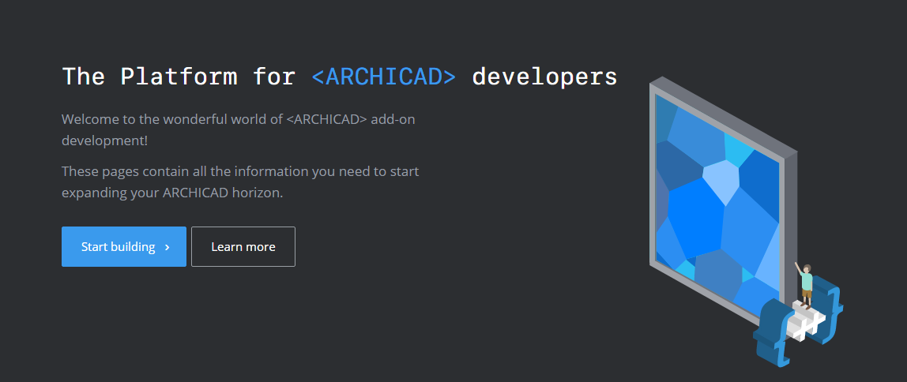

## Skills required for Build Architecture SW

> 건축 설계 프로그램들을 공부하는 Repository

### <u>

[Rhino 3D Developer Docs]: https://developer.rhino3d.com/

### </u>

<u>**Rhino 개발자 문서**</u>

*Rhino: NURBS, Curve, Solid, 다각형 메쉬 등의 생성, 편집, 분석/해석, 문서화, 렌더링하는 3D 모델링 소프트웨어*

제공 정보 : Rhino, Grasshopper 전반적인 기술 설명과 자주 묻는 질문, Rhino.Python/ RhinoScript/C-C++ 등 사용되는 언어들에 대해 적어두었다.

------

[GRAPHISOFT Developers]: https://archicadapi.graphisoft.com/blog

<u>**GRAPHISOFT ARCHICAD 개발자 플랫폼**</u>

*ARCHICAD : 디자인(모델링 포함), 도면화, 서버 상의 협업, 오브젝트 사용 외에도 BIM Tool로써도 사용이 가능한 건축 3D 설계 소프트웨어. 위의 Rhino+Grasshopper와 호환된다.*

제공 정보 : **Authentication Required**